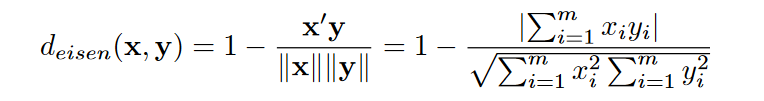

Text-Mining Tips & Tricks : removeSparseTerms
========================================================
author: Thibaut LOMBARD
date: November/January 2016/2017 
autosize: true


<style>
body {
	color: #f4f1de;
	font-size: 1em;
  background: #feffff;
    background: -moz-radial-gradient(center, ellipse cover, #feffff 0%, #ffffff 50%, #e3e3e3 100%);
    background: -webkit-radial-gradient(center, ellipse cover, #feffff 0%,#ffffff 50%,#e3e3e3 100%);
    background: radial-gradient(ellipse at center, #feffff 0%,#ffffff 50%,#e3e3e3 100%);
    filter: progid:DXImageTransform.Microsoft.gradient( startColorstr='#feffff', endColorstr='#e3e3e3',GradientType=1 );
}
}
</style>


Who Am I
========================================================
type: sub-section
Founder of **Ctrl + F Agency** (and all stuff related)
- Web/mobile Dev,
- Data science,
- Research
- Teaching

Age : 30 Years Old

Getting Started
=======================================================

* OrangePi And Ubuntu : [tutorial](https://blog.thibautlombard.space/installation-de-ubuntu-15-04-sur-orangepi-pc)

* Build and install Rstudio on OrangePI [HowTo](https://ctrlfagency.com/install-rstudio-ubuntu-armhf-architecture/)


What is it ?
========================================================
## Sparsity 
<font size=5>-- a sparse matrix is a matrix in which most of the elements are zero. The number of zero-valued elements divided by the total number of elements (e.g., m × n for an m × n matrix) is called the sparsity of the matrix (which is equal to 1 minus the density of the matrix) such as density measurement.</font> 

<font size=5>-- sparsity refers to the threshold of relative document frequency for a term, above which the term will be removed. Relative document frequency here means a proportion. In removeSparseTerms the sparsity is smaller as it approaches 1.0. </font>


Where
========================================================

#### Formula


- N is the number of documents 
- j is the term(s)

Usage of sparses formulas
========================================================
### Useful for
- [Convolutionnal neural network](https://fr.wikipedia.org/wiki/R%C3%A9seau_neuronal_convolutif)
- Resolving Differential equation problems

### Used into
- Auto-encoders 
- Natural Language Processing
- Image processing
- Suggest engines (semantic)


Libraries used 
========================================================
## [For Sparse.r](https://raw.githubusercontent.com/ctrlfagency/machinelearning/master/machinelearning/sparse/sparse.r)


```r
packages <- function(paquets)
{
new.paquets <- paquets[!(paquets %in% installed.packages()[, "Package"])] if(length(new.paquets))
install.packages(new.paquets, dependencies = TRUE, repos='http://cran.rstudio.com/')
sapply(paquets, require, character.only = TRUE)
}
packages(c("NLP", "tm", "NMF"))
```

========================================================  
# We create a matrix


```r
monTexte <- c("Bâchez la queue du wagon-taxi avec les pyjamas du fakir.",
              "la matrice du wagon-taxi",
              "le fakir est dans la matrice")
monCorpus <- Corpus(VectorSource(monTexte))
maTdm <- DocumentTermMatrix(monCorpus, control = list(minWordLength = 1))
```

========================================================  
# And inspect it

```r
inspect(maTdm)
```

```
<<DocumentTermMatrix (documents: 3, terms: 11)>>
Non-/sparse entries: 13/20
Sparsity           : 61%
Maximal term length: 10
Weighting          : term frequency (tf)

    Terms
Docs avec bâchez dans est fakir fakir. les matrice pyjamas queue
   1    1      1    0   0     0      1   1       0       1     1
   2    0      0    0   0     0      0   0       1       0     0
   3    0      0    1   1     1      0   0       1       0     0
    Terms
Docs wagon-taxi
   1          1
   2          1
   3          0
```

========================================================  
# Sparsity at 50%

```r
c <- removeSparseTerms(maTdm, 0.5)
inspect(c)
```

```
<<DocumentTermMatrix (documents: 3, terms: 2)>>
Non-/sparse entries: 4/2
Sparsity           : 33%
Maximal term length: 10
Weighting          : term frequency (tf)

    Terms
Docs matrice wagon-taxi
   1       0          1
   2       1          1
   3       1          0
```

========================================================  
# Sparsity at 90%

```r
d <- removeSparseTerms(maTdm, 0.9)
inspect(d)
```

```
<<DocumentTermMatrix (documents: 3, terms: 11)>>
Non-/sparse entries: 13/20
Sparsity           : 61%
Maximal term length: 10
Weighting          : term frequency (tf)

    Terms
Docs avec bâchez dans est fakir fakir. les matrice pyjamas queue
   1    1      1    0   0     0      1   1       0       1     1
   2    0      0    0   0     0      0   0       1       0     0
   3    0      0    1   1     1      0   0       1       0     0
    Terms
Docs wagon-taxi
   1          1
   2          1
   3          0
```


Bluiding A heatmap 
========================================================  


```r
b <- as.matrix(maTdm)
ch <- as.matrix(removeSparseTerms(maTdm, 0.5))
dh <- as.matrix(removeSparseTerms(maTdm, 0.9))
aheatmap(b, filename = "sparse-heatmap-matrix.png")
aheatmap(ch, filename = "sparse-heatmap-50percent.png")
aheatmap(dh, filename = "sparse-heatmap-99percent.png")
```

Heatmap results for No Sparsity 1/3
========================================================  


Heatmap results or 50% Sparsity 2/3
========================================================  


Heatmap results for 90% Sparsity 3/3
========================================================  


Cosine distance Matrix
========================================================  
### With cosine Eisen & al. (1998)


```r
distance_cosine <- dist(as.matrix(t(b)), method = "cosine")
distance_cosine
```

```
                avec    bâchez      dans       est     fakir    fakir.
bâchez     0.0000000                                                  
dans       1.0000000 1.0000000                                        
est        1.0000000 1.0000000 0.0000000                              
fakir      1.0000000 1.0000000 0.0000000 0.0000000                    
fakir.     0.0000000 0.0000000 1.0000000 1.0000000 1.0000000          
les        0.0000000 0.0000000 1.0000000 1.0000000 1.0000000 0.0000000
matrice    1.0000000 1.0000000 0.2928932 0.2928932 0.2928932 1.0000000
pyjamas    0.0000000 0.0000000 1.0000000 1.0000000 1.0000000 0.0000000
queue      0.0000000 0.0000000 1.0000000 1.0000000 1.0000000 0.0000000
wagon-taxi 0.2928932 0.2928932 1.0000000 1.0000000 1.0000000 0.2928932
                 les   matrice   pyjamas     queue
bâchez                                            
dans                                              
est                                               
fakir                                             
fakir.                                            
les                                               
matrice    1.0000000                              
pyjamas    0.0000000 1.0000000                    
queue      0.0000000 1.0000000 0.0000000          
wagon-taxi 0.2928932 0.5000000 0.2928932 0.2928932
```

========================================================  
### Cosine distance dendrogram


Euclidian distance Matrix
======================================================== 
### With euclidean formula


```r
distance_euclidian <- dist(as.matrix(t(b)), method = "euclidean")
distance_euclidian
```

```
               avec   bâchez     dans      est    fakir   fakir.      les
bâchez     0.000000                                                      
dans       1.414214 1.414214                                             
est        1.414214 1.414214 0.000000                                    
fakir      1.414214 1.414214 0.000000 0.000000                           
fakir.     0.000000 0.000000 1.414214 1.414214 1.414214                  
les        0.000000 0.000000 1.414214 1.414214 1.414214 0.000000         
matrice    1.732051 1.732051 1.000000 1.000000 1.000000 1.732051 1.732051
pyjamas    0.000000 0.000000 1.414214 1.414214 1.414214 0.000000 0.000000
queue      0.000000 0.000000 1.414214 1.414214 1.414214 0.000000 0.000000
wagon-taxi 1.000000 1.000000 1.732051 1.732051 1.732051 1.000000 1.000000
            matrice  pyjamas    queue
bâchez                               
dans                                 
est                                  
fakir                                
fakir.                               
les                                  
matrice                              
pyjamas    1.732051                  
queue      1.732051 0.000000         
wagon-taxi 1.414214 1.000000 1.000000
```

========================================================  
### Euclidean distance dendrogram


Dendrogram HowTo (hclust)
========================================================  

```r
fit <- hclust(distMatrix, method = "ward.D")
png(filename="sparse-clust.png",width=800,height=600)
plot(fit)
rect.hclust(fit, k = 3,border="blue")
```

========================================================  
# Thank you
